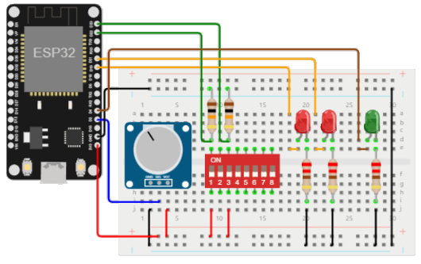
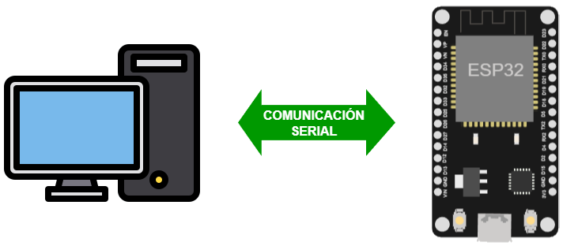

# Manejo del puerto serial

Cualquiera de las placas disponibles en el laboratorio tiene al menos un puerto serial (UART o SUART). A traves de este puerto es posible: 
1. La comunicación entre entre dos placas a traves de la conexión cruzada entre los pines de transmisión (```TX```) y recepción (```RX```) de estas. 
2. La comunicación entre una placa y el computador mediante USB (haciendo uso de un adaptador USB a Serial) el cual suele venir integrado con las placas.

Como punto de partida es importante conocer los pines que se pueden usar para la comunicación serial en una placa en particular por lo cual es necesario, antes de empezar, revisar el diagrama de pines y la documentación al respecto.

## Pines para el ESP32

A continuación se muestra el diagrama de pines de la placa NODEMCU ESP-32S la cual se encuentra disponible en el laboratorio:


Si se consulta la tabla de definición de pines del datasheet del **Nodemcu-32s** ([link](https://docs.ai-thinker.com/_media/esp32/docs/nodemcu-32s_product_specification.pdf)), los pines de interes seran:

|No.| Pin Name |Functional Description|
|---|---|---|
|34 |```RX```|```GPIO3```, ```U0RXD```, ```CLK_OUT2```|
|35 |```TX```|```GPIO1```, ```U0TXD```, ```CLK_OUT3```, ```EMAC_RXD2```|
|16 |```SD2```|```GPIO9```, ```SD_DATA2```, ```SPIHD```, ```HS1_DATA2```, ```U1RXD```|
|17 |```SD3```|```GPIO10```, ```SD_DATA3```, ```SPIWP```, ```HS1_DATA3```, ```U1TXD```|

Los pines ```TX``` y ```RX``` estan conectados con el chip que hace la conversion Serial a USB por lo que no pueden ser usados para otro proposito cuando se estan usando para la transmisión serial en la aplicación que corre la placa. Para mas información puede consultar la sección **Establish Serial Connection with ESP32** ([link](https://docs.espressif.com/projects/esp-idf/en/stable/esp32/get-started/establish-serial-connection.html)).

## Pines para el arduino

A continuación se muestra el diagrama de pines para el arduino UNO (la otra placa disponible en el laboratorio).


En este caso tenemos:

|No.| Pin Name |Functional Description|
|---|---|---|
|```0```|```RX<-0``` |```D0/RX```, ```PD0```|
|```1``` |```TX->1``` |```D1/TX```, ```PD1```|

Estos pines al ser conectados, no deberan ser usados como puertos digitales si la aplicación del arduino usa el puerto serial.

## Aplicaciones del puerto serial

Cuando se hace uso del puerto serial tenemos principalmente dos escenarios de aplicacion:
1. Debug de aplicaciones complejas.
2. Comunicación y transmisición de diferentes tipos de información (comandos, estado, Valor de variables, etc.) según el tipo de aplicación que se use.

Antes de entrar a hablar en detalle sobre estos escenarios, es necesario revisar en el **API de Arduino** ([link](https://www.arduino.cc/reference/en/)) la sección correspondiente a la comunicación serial ([link](https://www.arduino.cc/reference/en/language/functions/communication/serial/)). Alli podrá consultar todas las funciones empleadas para la implementación de la comunicación serial de las cuales, la siguiente tabla resume algunas de las de mayor utilidad:

|Función|Descripción|
|---|---|
|```Serial.begin(baudRate, [config])```|Permite inicializar los parametros de la configuración serial. La ```baudRate``` solo puede tomar alguno de los siguientes valores: ```300, 1200, 2400, 4800, 9600, 14400, 19200, 28800,  38400, 57600, 115200```|
|```Serial.end()```| Deshabilita la comunicación serial permitiendo que los pines ````RX``` y ```TX``` puedan ser usados como pines de entrada y salida (```I/O```).|
|```Serial.print(value, [format])```|Imprime los datos seriales en formato legible por humanos (human-readable) como texto ASCII con un opcional formato adicional|
|```Serial.println(value, [format])```|Hace lo mismo que la función ```Serial.print(...)``` pero agrega una ```newline```.|
|```Serial.write(value)```|Escribe datos binarios a través del puerto serie. Los datos se envían como un byte o una serie de bytes (no human-readable: ```raw```).|
|```Serial.available()```|Obtiene el numero de bytes (caracteres) disponibles para leer desde el puerto serial.|
|```Serial.read()```|Lee el primer byte (como entero ```int```) de los datos seriales entrantes (o ```-1``` si no hay datos disponibles).|
|```Serial.peek()```|Permite lectura sin remover datos. Para ello, retorna el proximo byte (como ```int```) de los datos seriales que entran sin removerlo del buffer serial interno (o ```-1``` si no hay datos disponibles).|
|```Serial.flush()```|Espera hasta que la transmisión de los datos seriales salientes se complete|
|```serialEvent()```|Función que se llama cuando hay datos en serie disponibles. Para mas información consultar el siguiente [link](https://docs.arduino.cc/built-in-examples/communication/SerialEvent)|

Es importante aclarar que las siguientes funciones son parte del API de Arduino. En caso de que se haga uso del ESP32, es necesario verificar si estas han sido portadas a esta plataforma en la pagina **Arduino core for the ESP32, ESP32-S2, ESP32-S3 and ESP32-C3** ([link](https://docs.espressif.com/projects/arduino-esp32/en/latest/)) o de lo contrario, el modelo de programación cambia y debera hacerse uso del **ESP-IDF Programming Guide** ([link](https://docs.espressif.com/projects/esp-idf/en/latest/esp32/)). Afortunadamente, la comunicación serial por **UART** si tiene soporte para el API Arduino-ESP32 (ver [tabla](https://docs.espressif.com/projects/arduino-esp32/en/latest/libraries.html)).

### Escenario 1 - Debug de aplicaciones

Una de las aplicaciones mas utilies del puerto serial es que facilita el **debug** de aplicaciones gracias a que por medio de este se pueden imprimir, en tiempo de ejecución, **mensajes de log** que sirven como verificar el correcto funcionamiento de la logica del programa al usar un programa como el monitor serial o cualquier programa similar. 

Es muy comun imprimir variables (que pueden indican el estado o valor de un sensor, mensajes de la aplicación, etc).

En el siguiente ejemplo ([link](debug_esp32/)) se muestra como hacer para el montaje mostrado a continuación:



### Escenario 2 - Comunicación con otras placas y con el PC

Por medio de operaciones de lectura y escritura en el puerto serial, es posible transmitir información desde y hacia otro dispositivo de hardware que tenga interfaz serial (Otra placa, computador o hardware especifico).

Para comprender esto en el siguiente [directorio](serial-esp32/) explicara paso a paso una aplicación mediante la cual se enviaran comandos por serial desde un el PC al ESP32 para una tarea sencilla como prender y apagar un led.




## Referencias

1. https://github.com/espressif/arduino-esp32#readme
2. https://learn.sparkfun.com/tutorials/esp32-thing-hookup-guide/all
3. https://makeabilitylab.github.io/physcomp/communication/serial-intro.html
4. https://learn.sparkfun.com/tutorials/terminal-basics/arduino-serial-monitor-windows-mac-linux
5. https://learn.sparkfun.com/tutorials/serial-communication
6. https://github.com/bjepson/Arduino-Cookbook-3ed-INO/tree/master/ch04
7. https://www.deviceplus.com/


<!---


https://github.com/espressif/arduino-esp32#readme

https://github.com/espressif/arduino-esp32


https://learn.sparkfun.com/tutorials/esp32-thing-hookup-guide/all
https://makeabilitylab.github.io/physcomp/communication/serial-intro.html


https://github.com/UdeA-IoT/ensayos-varios
https://github.com/UdeA-IoT/iot-UdeA_2022-1

https://github.com/UdeA-IoT/iot-2022_1/tree/main/percepcion/sesion1/esp32


https://docs.ai-thinker.com/_media/esp32/docs/nodemcu-32s_product_specification.pdf


All Arduino board has at least one serial port (aka UART or USART). It communicates on digital pin 0 (RX) and pin 1 (TX), as well as with the computer via USB (via USB-to-Serial adaptor). This serial port is represented by the Serial object. If you started serial, you cannot use pins 0 and 1. You can use Arduino IDE's Serial Monitor to communicate with Arduino board.

The Arduino Mega2560 has three additional serial ports: Serial1 on pins 18 (TX) and 19 (RX), Serial2 on pins 16 (TX) and 17 (RX), Serial3 on pins 14 (TX) and 15 (RX). There are NOT connected to the built-in USB-to-Serial adaptor, and you need an additional USB-to-Serial adaptor.


https://learn.sparkfun.com/tutorials/terminal-basics/arduino-serial-monitor-windows-mac-linux

https://learn.sparkfun.com/tutorials/serial-peripheral-interface-spi
https://learn.sparkfun.com/tutorials/serial-communication


https://github.com/UdeA-IoT/iot-UdeA_2022-1/tree/main/implementacion_paso_a_paso
https://makeabilitylab.github.io/physcomp/esp32/esp32.html


## Sobre la clase serial

Algunos ejemplos


https://github.com/bjepson/Arduino-Cookbook-3ed-INO/tree/master/ch04


### 4.1 Sending Information from Arduino to Your Computer

**Problem -> Cambiar por un random que simule un sensor**
You want to send text and data to be displayed on your PC, Mac, or other device (such as a Raspberry Pi) using the Arduino IDE or the serial terminal program of your choice.

```ino
/*
* SerialOutput sketch
* Print numbers to the serial port
*/
void setup()
{
Serial.begin(9600); // send and receive at 9600 baud
}
int number = 0;
void loop()
{
Serial.print("The number is ");
Serial.println(number); // print the number
delay(500); // delay half second between numbers
number++; // to the next number
}
```

CoolTerm
An easy-to-use freeware terminal program for Windows, Mac, and Linux
CuteCom
An open source terminal program for Linux
Bray Terminal
A free executable for the PC
GNU screen
An open source virtual screen management program that supports serial communications;
included with Linux and macOS
moserial
Another open source terminal program for Linux
PuTTY
An open source SSH program for Windows and Linux that supports serial
communications
RealTerm
An open source terminal program for the PC
ZTerm
A shareware program for the Mac

### 4.2 Sending Formatted Text and Numeric Data from
Arduino

Problem
You want to send serial data from Arduino displayed as text, decimal values, hexadecimal,
or binary.

https://github.com/bjepson/Arduino-Cookbook-3ed-INO/blob/master/ch04/ch04_SerialFormatting/ch04_SerialFormatting.ino


## 4.3 Receiving Serial Data in Arduino
Problem
You want to receive data on Arduino from a computer or another serial device; for
example, to have Arduino react to commands or data sent from your computer.

https://github.com/bjepson/Arduino-Cookbook-3ed-INO/blob/master/ch04/ch04_SerialReceive/ch04_SerialReceive.ino
https://github.com/bjepson/Arduino-Cookbook-3ed-INO/blob/master/ch04/ch04_SerialParsing/ch04_SerialParsing.ino


## 4.4 Sending Multiple Text Fields from Arduino in a
Single Message
Problem
You want to send a message that contains more than one field’s worth of information
per message. For example, your message may contain values from two or more sensors.
You want to use these values in a program such as Processing, running on a
computer or a device such as a Raspberry Pi.

https://github.com/bjepson/Arduino-Cookbook-3ed-INO/blob/master/ch04/ch04_SerialReceiveMultipleFields/ch04_SerialReceiveMultipleFields.ino

## 4.5 Receiving Multiple Text Fields in a Single Message
in Arduino
Problem
You want to receive a message that contains more than one field. For example, your
message may contain an identifier to indicate a particular device (such as a motor or
other actuator) and what value (such as speed) to set it to.

https://github.com/bjepson/Arduino-Cookbook-3ed-INO/blob/master/ch04/ch04_SerialReceiveMultipleFields/ch04_SerialReceiveMultipleFields.ino

## 4.7 Receiving Binary Data from Arduino on a Computer
Problem
You want to respond to binary data sent from Arduino in a programming language
such as Processing. For example, you want to respond to Arduino messages sent in
Recipe 4.6.

## 4.9 Sending the Values of Multiple Arduino Pins
Problem
You want to send groups of binary bytes, integers, or long values from Arduino. For
example, you may want to send the values of the digital and analog pins to
Processing.


## Ejemplo paso a paso

### Solo placa

https://github.com/UdeA-IoT/iot-UdeA_2022-1/tree/main/implementacion_paso_a_paso/paso1

### Placa - Python

https://github.com/UdeA-IoT/iot-UdeA_2022-1/tree/main/implementacion_paso_a_paso/paso2


### Placa - Python grafico

https://github.com/UdeA-IoT/iot-UdeA_2022-1/tree/main/implementacion_paso_a_paso/paso3


### Placa - deweto

Hacerlo ahora

https://github.com/UdeA-IoT/actividad-7

### Placa - FastAPI

Hacerlo ahora

https://github.com/UdeA-IoT/actividad-6


### Placa - NodeRed

Hacerlo Ahora


Referencias

https://github.com/bjepson/Arduino-Cookbook-3ed-INO
https://github.com/PacktPublishing/Internet-of-Things-with-Arduino-Cookbook
https://github.com/agusk/tutorial
https://github.com/agusk/xbee-wifi-python
https://github.com/Apress/Beginning-Arduino-Nano-33-IoT
https://github.com/Apress/ESP8266-and-ESP32
https://github.com/Apress/IoT-Development-for-ESP32-and-ESP8266-with-JavaScript


-->
