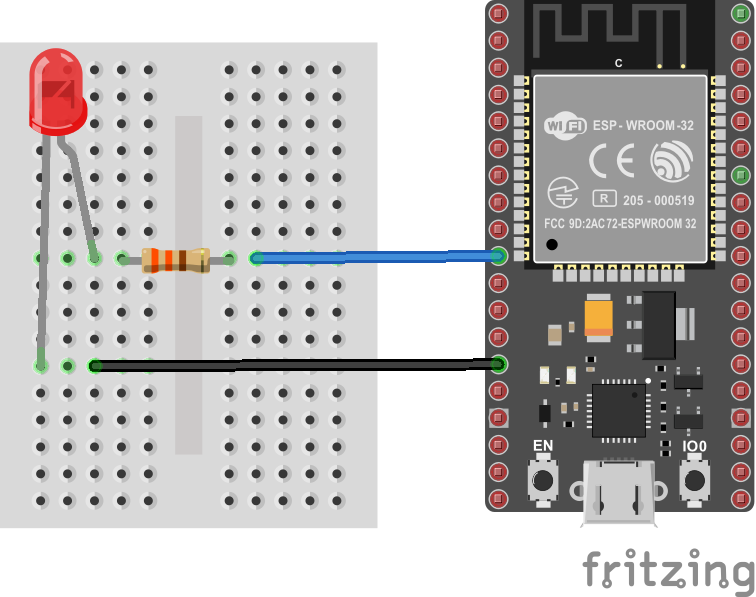
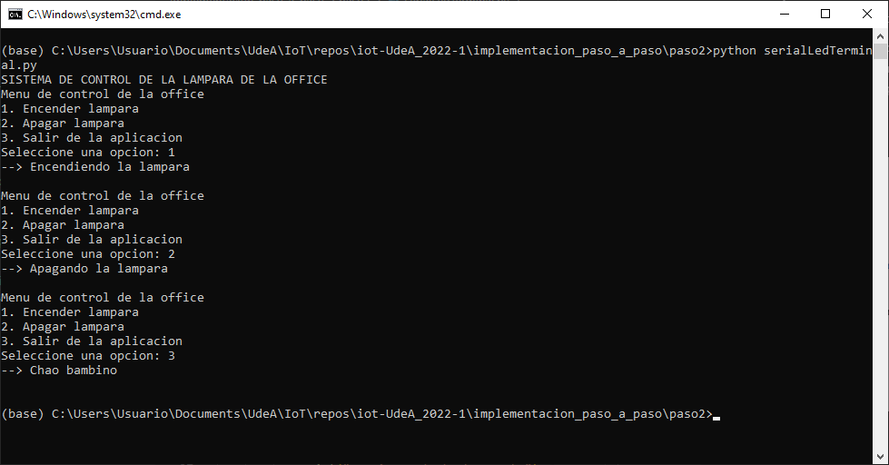
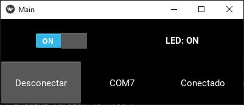

# Ejemplo de control de una ESP32 usando serial

El objetivo de esta sesión es explicar paso a paso como se construye una aplicación sencilla en la ESP que se comunique de manera serial con una aplicación que se esta ejecutando en un PC o RPi.

## Enuciado de la aplicación

Desarrolle una aplicación que permita encender y apagar un Led para el siguiente hardware:



La aplicación se conectara mediante el serial enviando dos comandos basicos para modificar el estado del led:

* **```H```**: Comando empleado para encender el Led.
* **```L```**: Comando empleado para apagar el Led.

El resultado final (si todo sale bien) de la aplicación de control es el siguiente:


## Implementación paso a paso

### Parte 1 - Implementación del firmware de la ESP32

Inicialmente, según los requerimientos de la aplicación, lo primero que se debe hacer el codificar el programa que va a descargarse en el ESP32. Teniendo en cuenta los puertos que se emplearán (ver diagrama de conexión) el programa queda como se muestra a continuación:

```ino
/* Entradas y salidas */
#define LIGHT1 26          // P26 (GPIO26)

/* Comandos */
#define LIGHT_ON 'H'       // Luz encendida  
#define LIGHT_OFF 'L'      // Luz apagada  

int cmd = 0; // Comnado entrado por serial

void setup() {
  // Configuración de los puertos digitales
  pinMode(LIGHT1, OUTPUT);    
  digitalWrite(LIGHT1, LOW);
  // Configuracion del puerto serial
  Serial.begin(9600); 
  
}

void loop() {
  // reply only when you receive data:
  if (Serial.available() > 0) {
    // read the incoming byte:
    cmd = Serial.read();

    // Encendido o apagado de la luz segun el comando
    if(cmd == LIGHT_ON) {
      digitalWrite(LIGHT1, HIGH);
      Serial.println("Light -> ON");
    }
    else if(cmd == LIGHT_OFF) {
      digitalWrite(LIGHT1, LOW);    
      Serial.println("Light -> OFF");
    } 
  }
}
```

Una vez codificado el programa y descargado en la ESP32, se procede a realizar la prueba empleando el monitor serial del Arduino IDE (empleando cualquier otra terminal serial ([link](https://learn.sparkfun.com/tutorials/terminal-basics/arduino-serial-monitor-windows-mac-linux))). La siguiente figura muestra este procedimiento:


Para mas información sobre este paso puede ir al siguiente [link](paso1/README.md).

### Parte 2 - Implementación del software de la aplicación de escritorio

Una vez verificado el correcto funcionamiento del Firmware del arduino, se procede al desarrollo de la aplicación de escritorio. En nuestro caso se desarrollo una aplicación de escritorio y una aplicación web muy sencilla.

### Aplicación de escritorio

Para desarrollar la aplicación de escritorio se empleo Python como lenguaje de desarrollo. Inicialmente, se hizo una aplicación que enviara los comandos por consola (mas facil de implementar) y posteriormente, se procedio a desarrollar una interfaz de usuario (un poco mas amigable) cuyo funcionamiento es similar al de la aplicación en consola

1. Desarrollo de la aplicación de consola en python ([link](paso2/README.md)).



2. Desarrollo de la aplicación con interfaz grafica usando python ([link](paso3/README.md)).



### Aplicación de web

1. Desarrollo del API

2. Desarrollo de una aplicación Web para el control targeta.
